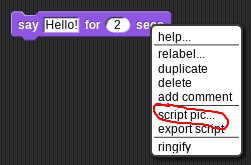

# Programming tutorials.

Do each of the tasks below, in order.

* Top-tip: Do one step at a time, and test.
* When done attach an image of your code to the classroom.
  * Use the script-pic tool: right click 
  * Then in the classroom choose upload 

<base target="_blank"/>

1. [One thing after another: Sequences](https://snap.berkeley.edu/snap/snap.html#present:Username=mr%20d&ProjectName=Sequences%20%e2%80%94%20shapes&editMode&noRun)
1. [Let's do it again: Iteration](https://snap.berkeley.edu/snap/snap.html#present:Username=mr%20d&ProjectName=Iteration%20%e2%80%94%20shapes&editMode&noRun)
1. [Text & Input](https://snap.berkeley.edu/snap/snap.html#present:Username=mr%20d&ProjectName=sequence%20%e2%80%94%20text&editMode&noRun)
1. [Make a choice: Selection](https://snap.berkeley.edu/snap/snap.html#present:Username=mr%20d&ProjectName=selection%20%e2%80%94%20text&editMode&noRun)
1. [Improve your score: Variables and events](https://snap.berkeley.edu/snap/snap.html#present:Username=mr%20d&ProjectName=variables%20%e2%80%94%20event&editMode&noRun)
1. [Text & Variables](https://snap.berkeley.edu/snap/snap.html#present:Username=mr%20d&ProjectName=variables%20%e2%80%94%20text&editMode&noRun)
1. [Define (procedures) — Drawing](https://snap.berkeley.edu/snap/snap.html#present:Username=mr%20d&ProjectName=define%20%28procedures%29%20%e2%80%94%20with%20drawing&editMode&noRun)
